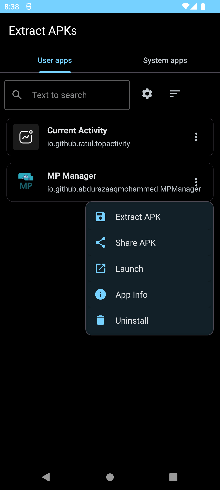
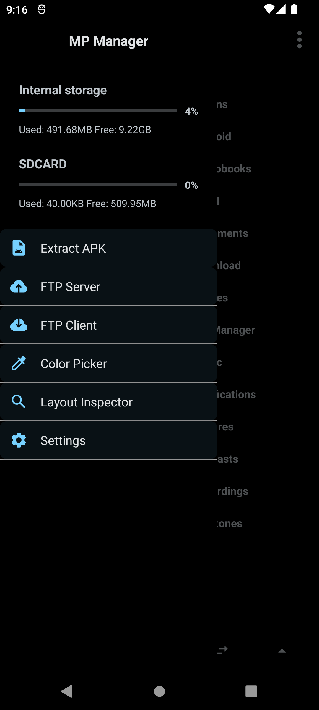

<p align="center">
  
</p>

<h1 align="center">Untrusted Manager</h1>

<p align="center">
  <strong>A dual-pane Android file manager, APK/DEX/resource toolkit, remote-storage client, developer toolbox, media workspace, and extensible plugin platform.</strong>
</p>

<p align="center">
  <a href="#features"></a>
  <a href="#plugin-sdk"></a>
  <a href="#architecture"></a>
  <a href="#security-and-data-safety"></a>
</p>

<p align="center">
  
  
  
</p>

> **Untrusted Manager** keeps its original app identity — **name and starting icon** — while this README documents the current project as a complete platform rather than as a pass-by-pass changelog.

---

## ✦ What is Untrusted Manager?

Untrusted Manager (UM) is an Android utility suite centered on a **dual-pane file manager**. The file manager is only the foundation: the same application also contains archive tooling, APK and DEX workspaces, Android resource editors, a professional text editor, managed/native binary tooling, remote storage, remote-control services, an MCP interface, media utilities, device utilities, calculators, productivity tools, and an installable plugin system.

The project is designed so that a user can move from **file → analysis → edit → rebuild/export** without repeatedly switching applications.

### Platform at a glance

| Capability | Included |
|---|:---:|
| Dual-pane local file manager | ✅ |
| Local file operations + batch operations | ✅ |
| ZIP / APK / JAR / 7z / RAR / TAR family | ✅ |
| APK analysis, editing, rebuild and signing workflows | ✅ |
| DEX / Smali / multidex tooling | ✅ |
| AXML + `resources.arsc` tooling | ✅ |
| Text/code editor + syntax highlighting | ✅ |
| HTML preview + embedded syntax | ✅ |
| Managed DLL / native PE / hex tooling | ✅ |
| FTP / FTPS server and client workflows | ✅ |
| SMB / SFTP / WebDAV / S3 | ✅ |
| HTTP remote management | ✅ |
| MCP local-file + APK workspace tools | ✅ |
| Terminal with normal / Shizuku / root backends | ✅ |
| Media player + image viewer/editor | ✅ |
| Comparison/diff tooling | ✅ |
| Android pinned shortcuts | ✅ |
| SAF/cloud backup and restore | ✅ |
| Service auto-start | ✅ |
| Third-party feature plugins | ✅ |
| 80 built-in Tools Kit entries | ✅ |

---

# ◆ Features

## 1. File Manager

### Dual-pane workspace

- Two independent panes.
- Independent navigation state and history.
- Back/forward and parent navigation.
- Home locations and refresh.
- Pane selection and synchronized navigation workflows.
- Bottom action bar for common file operations.
- Sidebar/bookmark drawer integration.

### Bookmarks and navigation

- Bookmark folders and locations.
- Bookmark groups.
- Reorder, rename, move and delete bookmark entries.
- Navigation history per pane.
- State restoration across normal file-manager navigation.
- Pinned file/folder shortcuts with stable IDs and safe labels.

### Selection

- Single selection.
- Multi-selection.
- Range/swipe selection.
- Select all.
- Invert selection.
- Select same type.
- Selection filtering and stale-selection pruning.
- Archive-aware selection that does not treat synthetic parent entries as ordinary files.

### Sorting and filtering

- Configurable filename sorting.
- Reverse sorting.
- Hidden-file handling.
- Filename filters.
- Search-history support.

### Search

- Recursive filename search.
- Case-sensitive matching.
- Regular-expression matching.
- Size limits.
- Recent-search history.
- Find-in-Files content search.
- UTF-8-aware text matching.
- Bounded result collection.
- Cancellation/interruption checks.
- Canonical-directory tracking.
- Symlink-directory exclusion to avoid recursive traversal loops.

### Filesystem operations

- Create files.
- Create folders.
- Rename.
- Copy.
- Move.
- Delete.
- Share.
- Open with Android's chooser/URI mechanisms.
- Properties with copyable metadata values.
- Local and elevated-operation paths where supported.
- Background execution for expensive operations.
- Progress reporting where the operation supports it.

### Batch operations

- Multi-copy.
- Multi-move.
- Multi-delete.
- Multi-rename.
- Multi-compress.
- Checksums over selected files.
- Command-helper operations over selected files.
- Batch APK signing/optimization/install workflows.
- Batch image operations.
- Selection validation before destructive operations.
- Partial-operation isolation and explicit failure reporting.

### Path safety

Create/rename operations reject unsafe child names such as empty names, `.`/`..`, NUL characters, path separators and absolute paths. Transfer paths are checked before ordinary filesystem work. Recursive transfer and archive paths are designed to avoid silently following symbolic links outside the requested tree.

---

# 2. Archives & Containers

UM treats common Android and general-purpose containers as editable workspaces rather than merely files to extract.

### ZIP / APK / JAR

- Browse entries.
- Browse directories inside archives.
- Extract entries.
- Add entries.
- Delete entries.
- Rename entries.
- Create archives.
- Modify existing archives.
- APK/JAR-aware workflows.
- Collision-safe extraction.
- Transactional archive updates where implemented.
- Backup/verification before sensitive archive rewrites.

### 7z

- Extraction.
- Archive creation.
- Path-constrained destination handling.

### RAR

- RAR extraction through the integrated JunRAR stack.
- Destination safety checks.

### TAR family

- TAR.
- GZIP-compressed TAR.
- BZIP2-compressed TAR.
- XZ-compressed TAR.
- Hardened extraction.
- Symbolic/hard-link rejection on the hardened extraction path.

### Archive safety

- Path traversal protection.
- NUL/path-component validation.
- Duplicate-entry handling.
- Destination collision handling.
- Symbolic-link traversal defenses.
- Archive-directory validation.
- Transactional/verified write paths where the editor supports them.

---

# 3. APK Studio

The APK workflow is one of UM's core developer-oriented areas.

### APK inspection

- Package name.
- Version information.
- Application metadata.
- Launcher/activity information.
- APK icon extraction.
- Manifest inspection.
- Resource inspection.
- DEX discovery.
- Native-library discovery.
- Base/split APK awareness.
- Signature information.

### APK editing

- Manifest editing.
- Application-attribute editing.
- Resource workflows.
- DEX/Smali workflows.
- APK extraction.
- Quick-edit operations.
- Clone/optimization workflows.

### Build and signing

- Rebuild APK workspaces.
- Signing workflows.
- Supported keystore/key formats.
- Configurable automatic signing paths.
- Split-APK workflows where supported by the existing installer/tooling.
- Output validation rather than silently reporting an invalid build as successful.

### APK Patcher / LPZIP-style tooling

The Tools Kit also exposes APK patching workflows for supported patch formats and byte-pattern based CLASSES/ODEX/LIB operations.

---

# 4. DEX, Smali & Bytecode

UM contains integrated dexlib2, smali/baksmali and APK-editor infrastructure.

### DEX editor

- Open DEX files.
- Work with multidex APKs.
- Inspect classes and methods.
- Edit supported DEX structures.
- Save validated DEX output.
- Smali conversion.
- String-oriented workflows.
- DEX inspection/repair paths.

### DEX++ / merge workflows

- Merge supported DEX inputs.
- Duplicate-class detection.
- Transactional output.
- Output validation before committing a merged result.

### Smali

- Disassembly.
- Search/navigation.
- Editing.
- Reassembly through the integrated smali toolchain.
- APK workspace integration.

---

# 5. Android XML & Resource Studio

## AXML

Binary Android XML can be decoded, edited and encoded again.

- Typed attributes.
- References.
- Booleans.
- Dimensions.
- Fractions.
- Floats.
- Integers.
- Colors.
- Typed list attributes.
- Namespace URI preservation.
- Text-editor integration.

## `resources.arsc` / ARSC++

- Resource-table inspection.
- Multi-configuration editing.
- String-pool editing.
- Search.
- Arrays.
- Styles.
- Complex map values.
- Individual map-value editing.
- Export.
- Transactional save paths.
- Comparison/refactoring utilities.

Framework APK discovery can use `0/Untrusted Manager/frameworks/` and device framework resources where available.

---

# 6. Text & Code Studio

UM's editor is based on the integrated Sora/TextMate editor stack and is intended for actual source editing rather than a plain text box.

### Editor capabilities

- Tabs.
- Undo/redo.
- Search.
- Replace.
- Regex workflows.
- Session restoration.
- Backup/session persistence.
- Large-file safety limits.
- UTF-8 BOM handling.
- CRLF/LF/CR preservation.
- AXML editing.
- Language-specific syntax highlighting.

### Languages/workflows covered by the syntax stack

- XML.
- AXML.
- HTML.
- CSS.
- JavaScript.
- JSON.
- C#.
- IL.
- Python.
- YAML.
- Markdown.
- GDScript.
- Ren'Py.
- Godot resources/shaders.

### HTML workspace

- Dedicated HTML preview.
- Editor preview workflow.
- File-manager HTML preview action.
- Embedded CSS syntax.
- Embedded JavaScript syntax.
- Embedded JSON script-block syntax.
- Markdown language-specific fenced-code syntax.

---

# 7. Managed DLL / PE / Hex Studio

## Managed DLL editor

The DLL editor contains an independently maintained PE/CLI reader, metadata navigator, C# decompiler/editor and conservative CIL writer.

### Assembly inspection

- PE/COFF probing.
- CLR metadata discovery.
- Recovery of stale metadata roots where valid metadata can be found.
- ECMA-335 table reading.
- Type/member navigation.
- Methods.
- Fields.
- Properties.
- Interfaces.
- Generics.
- Decompiled C# document navigation.

### C# workflow

1. Open a managed assembly.
2. Inspect/decompile it.
3. Edit the reconstructed source.
4. Store editable source under `0/Untrusted Manager/DLL/EditedSource/`.
5. Compile using the managed compiler backend when available.
6. Write the resulting assembly under `0/Untrusted Manager/DLL/Edited/`.
7. Keep the original DLL untouched.

The compiler backend prefers Roslyn `csc.exe` where provisioned and can fall back to Mono `mcs.exe`.

### IL workflow

- Decode supported CIL instructions.
- Edit supported instructions.
- Write new method bodies.
- Preserve supported locals/init-locals state and metadata tokens.
- Relocate larger replacement method bodies into a dedicated `.umcil` PE section where required.
- Reparse the resulting image before reporting success.
- Reject unsupported extra method-section/exception-handling layouts rather than writing stale offsets.

### Native PE and hex

- Native/unmanaged PE inspection.
- Raw hex editing.
- Inspection of malformed/protected binaries without incorrectly labeling them as managed assemblies.

---

# 8. Game Analysis & Modding Toolkit

The integrated game-analysis surface includes:

- Game Analyzer.
- IL2CPP Dumper.
- Global Metadata inspector.
- Game-encryption inspection utilities.
- Game Modding Toolkit.
- IL2CPP Editor.
- Frida Runtime Kit.
- DLL Editor.

The IL2CPP workflow can work with an APK and/or supplied `libil2cpp.so` and `global-metadata.dat` inputs where supported by the current dumper path. Dump-oriented outputs use the Untrusted Manager workspace conventions rather than requiring a separate helper application.

---

# 9. Remote Storage & Networking

## FTP / FTPS

- FTP client workflows.
- FTP server workflows.
- FTPS server/client workflows.
- Profiles.
- Passive mode.
- Binary transfers.
- Connection/data timeouts.
- Transfer verification.
- Delete/rename/create operations.
- Certificate validation.
- FTPS hostname verification.
- Protected profile credentials.
- Boot/package-replacement restoration when auto-start is explicitly enabled.

## SMB

- SMB2/SMB3 browsing.
- Authentication.
- Secure signing defaults.
- Downloads/uploads.
- Atomic temporary-download handling.
- Transfer-size verification.

## SFTP

- SSH/SFTP browsing.
- Upload/download.
- Host-key fingerprint pinning.
- Explicit trust-any mode for controlled first-time setup.
- Staged transfers and result verification.

## WebDAV

- PROPFIND listing.
- Download/upload.
- MKCOL.
- Delete.
- Move.
- XML external-entity protections.
- Path traversal protection.
- Download-size verification.

## S3

- Object listing.
- Upload/download/delete.
- Directory-style operations.
- SigV4 signing.
- Canonical query handling.
- Streaming transfers.

## HTTP Remote Management

- Remote browser/file-manager workflow.
- Authenticated HTTP service.
- Bearer authentication.
- Constrained source/destination operations.
- Symlink-ancestor rejection.
- Collision-safe copy/move/rename.
- Atomic text writes.

## Network Storage Hub

Saved locations use stable per-location IDs and isolated preference namespaces so endpoint data does not accidentally bleed between unrelated profiles.

## Network Transfers

A unified transfer surface exposes queued remote operations, cancellation and transfer history.

---

# 10. MCP — AI File & APK Workspace

UM exposes a Streamable-HTTP MCP service for automation/AI clients.

### Local file MCP

- File listing.
- Read/write operations.
- Copy/move operations.
- Path-level permissions.
- Read-only / read-write / deny rules.
- Canonical-path enforcement.
- Symlink rejection.

### APK MCP

APK workspaces are isolated from the original source file.

- Open APK into a workspace.
- List workspaces.
- Inspect workspace metadata.
- Delete workspaces.
- List APK ZIP entries.
- Read entries.
- Write entries.
- Delete entries.
- Inspect Android package metadata.
- Search DEX classes.
- Disassemble/read Smali.
- Edit Smali.
- Reassemble changed DEX content.
- Rebuild the APK workspace.
- Sign output using the supported signing path.

### Authentication

- Authentication can be disabled for controlled local use.
- Active service token support is retained.
- Named Bearer tokens can be created and revoked.
- Authentication state is persisted with the remote-service configuration.

### Service lifecycle

HTTP/MCP service restoration after boot/package replacement is user opt-in. Android foreground-service restrictions are handled by the current service architecture.

---

# 11. Terminal

The standalone terminal provides a persistent shell surface with:

- Normal app shell.
- Shizuku shell.
- Root shell where available.
- Persistent shell state.
- Working-directory startup.
- Command history.
- Bounded output.
- Clear output.
- Interrupt input.
- Tools Hub integration.

Availability of Shizuku/root behavior depends on the device and the corresponding external authorization/environment.

---

# 12. Comparison & Diff

- Text comparison.
- APK comparison.
- ZIP comparison.
- ARSC comparison.
- Nested comparison.
- Asynchronous comparison work.
- Progress reporting.
- SHA-256 content confirmation after fast-path equality checks.
- File-read failure isolation so one unreadable comparison entry does not unnecessarily abort the entire comparison.
- Rendering safety limits for pathological inputs.

---

# 13. Media & Images

## Media player

- Audio playback.
- Video playback.
- Queue management.
- Seek.
- Speed control.
- Volume.
- Mute.
- Repeat.
- Shuffle.
- A-B repeat.
- Background/miniplayer behavior.
- Resume-position persistence.
- Defensive lifecycle cleanup.

## Streaming headers

Persistent HTTP header rules can target:

- Exact URLs.
- URL prefixes.
- Global requests.

The same rules are wired into metadata probing and media playback.

## Image viewer/editor

- Image viewing.
- Directory navigation.
- Metadata inspection.
- Share/delete workflows.
- Image editing utilities exposed through the Tools Kit.
- Batch crop/EXIF/metadata workflows where supported.

---

# 14. Device & Hardware Tools

The built-in Tools Kit includes:

| Tool | Purpose |
|---|---|
| Device Hub | Hardware, battery, CPU, sensors and storage information |
| Compass | Magnetic heading |
| Bubble Level | Surface-level measurement |
| GPS Speedometer | Live speed |
| Ruler | On-screen cm/inch ruler |
| Protractor | Touch angle measurement |
| Magnifier | Zoomed inspection/loupe |
| Flashlight | Torch/fullscreen light |
| Vibration Studio | Custom vibration patterns |
| Strobe Light | Fullscreen flashing |
| Screen Tester | Fullscreen/dead-pixel test |
| Volume Panel | Audio stream controls |
| Ringtone Preview | Browse/play device sounds |
| Wallpaper Maker | Color-wheel/gradient wallpaper generation |
| Wi-Fi Manager | DNS/profile/password/usage utilities |
| Connectivity Hub | Network/Bluetooth/NFC-related device utilities |
| QR Scanner | Camera barcode/QR scanning |
| QR Generator | Text, URL and Wi-Fi QR generation |
| NFC Reader | NFC tag reading |
| Bluetooth Pairs | Bonded-device inspection |

---

# 15. Math, Finance & Conversion Tools

### Mathematics

- Scientific Calculator.
- Unit Converter.
- Base Converter — binary/octal/decimal/hexadecimal.
- Prime Tools — prime/factor operations.
- Quadratic Solver.
- 2×2 Matrix calculator.
- Triangle Solver.
- Geometry Calculator.
- Fraction Calculator.

### Finance

- Price & Tax Lab.
- Discount calculations.
- GST calculations.
- Tip calculations.
- Percentage comparisons.
- Finance Lab.
- EMI calculations.
- Interest calculations.
- Savings calculations.
- Currency Converter with offline rates.
- Fuel Calculator.
- Mileage/cost calculations.
- Pace Calculator.
- Ohm's Law calculator.
- Resistor color-band decoder.
- GPA calculator.
- Cooking converter for common cup/gram-style conversions.

---

# 16. Time, Productivity & Personal Utilities

- Timer Suite.
  - Stopwatch.
  - Timer.
  - Pomodoro.
  - Interval timing.
- World Clock.
- Date Toolkit.
  - Date difference.
  - Age calculation.
  - Date addition.
  - Countdown.
- Quick Notes.
- Checklist.
- Habit Tracker.
- Expense Tracker.
- Attendance Tracker.
- Tally Counter.
- Typing Test.
- Health Hub.
  - BMI.
  - Calories.
  - Body-fat-related calculations.
  - Water utilities.
  - Sleep-related utilities.

---

# 17. Text, Encoding & Security Utilities

- Text Studio.
  - Character/word counting.
  - Case conversion.
  - Lorem generation.
  - JSON utilities.
  - Regex utilities.
- Encoder Lab.
  - Hashes.
  - Base64.
  - URL encoding/decoding.
  - Binary conversion.
  - Supported cipher/encoding utilities.
- Color Converter.
  - HEX.
  - RGB.
  - HSL.

---

# 18. Media & Random Utilities

### Media

- Tone Generator.
- Voice Recorder.
- Metronome.
- Speak Text / text-to-speech.

### Random / generation

- Randomizer.
  - Dice.
  - Coin.
  - Number generation.
- Generator Studio.
  - Password generation.
  - UUID generation.
  - Random values.

---

# 19. Storage, System & Access Utilities

- Storage Manager.
  - Largest-file discovery.
  - Cache-oriented utilities.
- Quick Settings shortcuts.
- Root Manager.
  - Root access where available.
  - Shizuku access where available.
  - Non-root operation.
- Cloud Backup.
  - SAF destinations.
  - Cloud document providers exposed through SAF.
  - Versioned backup format.
  - Validation.
  - Sensitive-key exclusion.
- Android pinned shortcuts for supported files/folders/tools.

---

# 20. Tools Kit — all built-in entries

The current source registers **80 built-in tool entries**, before separately installed plugins are added dynamically.

<details>
<summary><strong>Storage & Apps</strong> — 6 built-in tools</summary>

- APK Patcher
- Lucky Patcher
- Root Manager
- Terminal
- Storage Manager
- Quick Settings
</details>

<details>
<summary><strong>Game Analysis & Modding</strong> — 8 built-in tools</summary>

- Game Analyzer
- IL2CPP Dumper
- Global Metadata
- Game Encryption
- Game Modding Toolkit
- IL2CPP Editor
- Frida Runtime Kit
- DLL Editor
</details>

<details>
<summary><strong>Wi-Fi & Network</strong> — 14 built-in tools</summary>

- Wi-Fi Manager
- Connectivity Hub
- HTTP Remote Management
- MCP Service
- Network Storage
- Network Transfers
- WebDAV Storage
- S3 Storage
- SMB Storage
- SFTP Storage
- QR Generator
- QR Scanner
- NFC Reader
- Bluetooth Pairs
</details>

<details>
<summary><strong>Device & Hardware</strong> — 14 built-in tools</summary>

- Device Hub
- Compass
- Bubble Level
- GPS Speedometer
- Ruler
- Protractor
- Magnifier
- Flashlight
- Vibration Studio
- Strobe Light
- Screen Tester
- Volume Panel
- Ringtone Preview
- Wallpaper Maker
</details>

<details>
<summary><strong>Math & Finance</strong> — 18 built-in tools</summary>

- Calculator
- Unit Converter
- Base Converter
- Prime Tools
- Quadratic Solver
- Matrix 2x2
- Triangle Solver
- Geometry Calc
- Fraction Calc
- Price & Tax Lab
- Finance Lab
- Currency Converter
- Cooking Converter
- Fuel Calculator
- Pace Calculator
- Ohm Law Calc
- Resistor Decoder
- GPA Calculator
</details>

<details>
<summary><strong>Time & Productivity</strong> — 11 built-in tools</summary>

- Timer Suite
- World Clock
- Date Toolkit
- Quick Notes
- Checklist
- Habit Tracker
- Expense Tracker
- Attendance Tracker
- Tally Counter
- Typing Test
- Health Hub
</details>

<details>
<summary><strong>Text & Security</strong> — 3 built-in tools</summary>

- Text Studio
- Encoder Lab
- Color Converter
</details>

<details>
<summary><strong>Media & Sound</strong> — 4 built-in tools</summary>

- Tone Generator
- Voice Recorder
- Metronome
- Speak Text
</details>

<details>
<summary><strong>Random</strong> — 2 built-in tools</summary>

- Randomizer
- Generator Studio
</details>

---

# 21. Plugin SDK

Plugins are **independently installed Android APKs**. They are discovered by UM automatically and appear in Tools Kit as first-class feature entries.

A plugin does **not** require rebuilding the UM base APK when it is added or updated.

## Plugin architecture

```text
Third-party plugin APK
        │
        ├── ACTION_ENTRY activity
        ├── UmPluginContract metadata
        └── UmPluginActivity implementation
                    │
                    ▼
          Untrusted Manager discovery
                    │
          compatibility + identity checks
                    │
                    ▼
              Plugin Manager
                    │
             enabled / disabled
                    │
                    ▼
                Tools Kit
                    │
                    ▼
             Plugin Activity
```

## Stable API

The SDK lives in:

```text
plugin-api/
```

Important classes:

```text
untrusted.manager.um.plugin.api.UmPluginContract
untrusted.manager.um.plugin.api.UmPluginActivity
```

Current host API version:

```text
1
```

## Step 1 — Create a plugin Android module

For a separate plugin project, create a normal Android application module and depend on the UM plugin API.

If you are developing the plugin alongside this source tree, you can use the local API module:

```gradle
dependencies {
    implementation project(':plugin-api')
}
```

For a standalone plugin project, publish/copy the compatible `plugin-api` Android library into your own dependency setup. The plugin API is deliberately small: the host/plugin boundary is an Android activity contract rather than a dependency on UM's private implementation classes.

## Step 2 — Implement the plugin activity

```java
package com.example.umplugin;

import android.os.Bundle;
import android.widget.TextView;

import untrusted.manager.um.plugin.api.UmPluginActivity;

public final class ExamplePluginActivity extends UmPluginActivity {
    @Override
    protected void onCreate(Bundle savedInstanceState) {
        super.onCreate(savedInstanceState);

        TextView view = new TextView(this);
        view.setText("Hello from an Untrusted Manager plugin");
        view.setPadding(32, 32, 32, 32);
        setContentView(view);
    }
}
```

The base activity exposes the host-provided context helpers:

```java
pluginId()
inputPath()
inputUri()
inputMime()
```

These allow a plugin to understand which plugin entry launched it and, when the host supplies a file context, what file/URI/MIME type was associated with the launch.

## Step 3 — Register the plugin entry point

Declare an exported activity with the stable UM action and metadata:

```xml
<activity
    android:name=".ExamplePluginActivity"
    android:exported="true"
    android:label="Example Plugin">

    <intent-filter>
        <action android:name="untrusted.manager.um.plugin.ACTION_ENTRY" />
        <category android:name="android.intent.category.DEFAULT" />
    </intent-filter>

    <meta-data
        android:name="untrusted.manager.um.plugin.id"
        android:value="example.tool" />

    <meta-data
        android:name="untrusted.manager.um.plugin.name"
        android:value="Example Tool" />

    <meta-data
        android:name="untrusted.manager.um.plugin.description"
        android:value="A demonstration UM feature plugin" />

    <meta-data
        android:name="untrusted.manager.um.plugin.category"
        android:value="Plugins" />

    <meta-data
        android:name="untrusted.manager.um.plugin.api"
        android:value="1" />

    <meta-data
        android:name="untrusted.manager.um.plugin.min_api"
        android:value="1" />
</activity>
```

## Metadata reference

| Metadata | Required | Meaning |
|---|:---:|---|
| `untrusted.manager.um.plugin.id` | ✅ | Stable plugin ID; max 64 chars and limited to letters, digits, `.`, `_`, `-` |
| `untrusted.manager.um.plugin.name` | ✅ | User-facing feature name |
| `untrusted.manager.um.plugin.api` | ✅ | API version implemented by the plugin |
| `untrusted.manager.um.plugin.min_api` | ✅ | Oldest host API required |
| `untrusted.manager.um.plugin.description` | Optional | Feature description shown in Tools Kit |
| `untrusted.manager.um.plugin.category` | Optional | Tools Kit category; defaults to Plugins |
| `untrusted.manager.um.plugin.icon` | Optional | Plugin icon metadata |

## File-context contract

When a plugin is launched with file context, UM can provide:

```java
UmPluginContract.EXTRA_INPUT_URI
UmPluginContract.EXTRA_INPUT_PATH
UmPluginContract.EXTRA_INPUT_MIME
```

The plugin ID is supplied through:

```java
UmPluginContract.EXTRA_PLUGIN_ID
```

Example:

```java
String path = inputPath();
String mime = inputMime();
android.net.Uri uri = inputUri();
```

A plugin should treat all incoming paths and URIs as untrusted input and perform its own validation before reading or writing data.

## Plugin lifecycle inside UM

1. Android installs the plugin APK.
2. UM discovers activities advertising `ACTION_ENTRY`.
3. UM reads plugin metadata.
4. UM validates plugin identity and API compatibility.
5. UM filters disabled/incompatible entries.
6. Enabled plugins are added to the Tools Kit registry.
7. The plugin's application icon can be used by the host UI.
8. Selecting the plugin launches its declared activity.
9. The host supplies the plugin ID and optional file context.

Plugins remain separate Android packages. Android controls their installation/removal; UM controls discovery, compatibility filtering and enabled/disabled state.

## Plugin development rules

- Keep the plugin ID stable after release.
- Do not depend on UM's private Java implementation packages.
- Depend only on the published/stable `plugin-api` contract for host integration.
- Validate every incoming URI/path.
- Do not assume a file context is present.
- Do not assume root, Shizuku or special permissions exist.
- Handle API incompatibility gracefully.
- Keep plugin UI self-contained.
- Use your own application package and signing key.
- Test install, disable, re-enable, update and uninstall behavior.
- Avoid claiming compatibility with an API version the plugin has not actually tested.

## Minimal plugin project layout

```text
MyUmPlugin/
├── app/
│   ├── src/main/
│   │   ├── AndroidManifest.xml
│   │   └── java/com/example/umplugin/
│   │       └── ExamplePluginActivity.java
│   └── build.gradle
├── settings.gradle
└── README.md
```

---

# 22. Project Architecture

```text
Untrusted Manager
│
├── app/                         # Android application
│   └── src/main/
│       ├── java/
│       │   ├── file manager + UI
│       │   ├── archive engines
│       │   ├── APK / DEX / Smali
│       │   ├── AXML / ARSC
│       │   ├── DLL / PE / IL
│       │   ├── network clients/servers
│       │   ├── MCP / HTTP remote services
│       │   ├── media/editor
│       │   └── Tools Kit
│       └── res/
│
├── plugin-api/                 # Stable third-party plugin contract
│   └── src/main/java/
│       └── untrusted/manager/um/plugin/api/
│
├── images/                     # Project screenshots/assets
├── tools/                      # Development/build helper scripts
├── gradlew                     # Gradle wrapper
└── README.md
```

### Major internal surfaces

- `UMManager` — primary file-manager/navigation application layer.
- `tools` — Tools Kit, registry, runner and plugin management.
- `network` — SMB/SFTP/WebDAV/S3/network transfer surfaces.
- `remote` — HTTP remote management.
- `arsc` — resource-table editors.
- `player` — media/image workflows.
- `gameanalysis` — IL2CPP/game-analysis workflows.
- `patcher` — APK patching workflows.
- `plugin-api` — stable external plugin contract.

---

# 23. Storage Layout

The application uses an `Untrusted Manager` workspace under shared storage for user-facing persistent artifacts where the relevant feature requires it.

Common locations include:

```text
0/Untrusted Manager/
├── logs/
├── Dump/
├── DLL/
│   ├── EditedSource/
│   └── Edited/
└── frameworks/
```

Feature-specific subdirectories may be created as needed. The application-private area is used for sensitive service state and isolated MCP APK workspaces where appropriate.

---

# 24. Security & Data Safety

UM is intentionally defensive around operations that can corrupt or escape a requested workspace.

### Filesystem

- Reject unsafe child names.
- Validate source/destination relationships.
- Avoid recursive traversal through symbolic links on hardened paths.
- Verify copies/moves where supported.
- Clean up failed partial destinations where possible.

### Archives

- Constrain extraction destinations.
- Reject traversal components.
- Validate archive paths.
- Avoid unsafe link extraction on hardened TAR paths.
- Verify sensitive archive rewrites.

### Network

- Encrypted profile storage where implemented.
- FTPS certificate/hostname validation.
- SFTP host-key pinning with explicit trust-any escape hatch.
- MCP/HTTP path confinement.
- Server-side read/read-write/deny permissions.
- Bearer authentication options.

### APK / binary editing

- Original files are preserved by workflows that create edited outputs.
- Rebuild/sign operations are explicit.
- Unsupported binary layouts should fail rather than silently produce stale offsets.
- MCP APK workspaces are isolated from source APKs.

### Permissions

Some tools require Android permissions or device capabilities. Root/Shizuku, NFC, camera, GPS, Bluetooth, network, storage-provider access and other capabilities are used only when the corresponding feature requires them. The presence of a tool does not imply that every device can provide every underlying capability.

---

# 25. Building from Source

UM is a standard Android Gradle project with two modules:

```text
:app
:plugin-api
```

The project currently targets:

```text
compileSdk 36
targetSdk 37
minSdk 19
Java 17
```

Typical commands:

```bash
./gradlew assembleDebug
```

or:

```bash
./gradlew :app:assembleDebug
```

For source-only Java compilation when the required Gradle distribution/dependencies are already available:

```bash
./gradlew :app:compileDebugJavaWithJavac --no-daemon
```

> A successful source audit is not the same thing as a successful Android build. A complete build requires the configured Gradle distribution and all Android/Maven dependencies to be available in the environment.

---

# 26. Verification Philosophy

The project treats **“the button exists”** and **“the feature works”** as different things.

A feature is expected to have:

- A real implementation.
- A reachable UI entry point where applicable.
- Correct tool-registry wiring.
- Correct launcher/intent dispatch.
- Correct manifest declarations.
- Correct resource references.
- Error handling for invalid input.
- Persistence behavior where required.
- Safe cancellation for expensive work.
- No fake success result.
- No placeholder-only screen.
- No unfinished `TODO`/`FIXME` implementation standing in for a feature.

The source audit also checks for the classic failure mode where a tool is registered and visible but its click path is not actually handled.

---

# 27. Current Feature Matrix

| Area | Source state |
|---|---|
| File manager | 🟢 Implemented + hardened |
| FTP | 🟢 Implemented |
| FTPS | 🟢 Implemented |
| SMB | 🟢 Implemented |
| WebDAV | 🟢 Implemented |
| SFTP | 🟢 Implemented |
| S3 | 🟢 Implemented |
| HTTP remote management | 🟢 Implemented |
| MCP + APK-MCP | 🟢 Pass 19 complete |
| Plugin system / SDK | 🟢 Implemented |
| ZIP / APK / JAR | 🟢 Implemented |
| 7z | 🟢 Implemented |
| RAR | 🟢 Implemented |
| TAR family | 🟢 Implemented |
| DEX | 🟢 Implemented + hardened |
| DEX++ | 🟢 Implemented + hardened |
| AXML | 🟢 Implemented + hardened |
| ARSC++ | 🟢 Implemented + hardened |
| Text editor | 🟢 Implemented + hardened |
| HTML preview | 🟢 Implemented |
| HTML embedded syntax | 🟢 Implemented |
| Media player | 🟢 Implemented + hardened |
| Streaming headers | 🟢 Implemented |
| Terminal | 🟢 Implemented |
| Comparison | 🟢 Implemented + hardened |
| Batch operations | 🟢 Pass 19 complete |
| Shortcuts | 🟢 Implemented |
| Cloud backup | 🟢 Implemented |
| Search/history edge cases | 🟢 Hardened |
| Service auto-start | 🟢 Implemented |

---

# 28. Development Notes

### Do not treat generated build output as source

The repository's source of truth is the source tree. APKs, Gradle build directories and generated artifacts are not substitutes for the implementation.

### Keep the plugin contract stable

Changes to `UmPluginContract` can affect independently installed plugin APKs. Additive changes should preserve existing metadata/action names whenever possible.

### Keep user data safe

New file/archive/network features should follow the existing validation and transactional patterns instead of introducing a second, weaker path implementation.

### Keep UI actions reachable

When adding a Tools Kit item, always add the corresponding launcher path and test the full chain:

```text
Tools Hub
  → ToolRegistry ID
  → click handler
  → Activity / runner
  → actual feature implementation
  → success/failure result
```

---

# 29. Contributing a New Built-in Tool

For a built-in feature, the normal integration path is:

1. Implement the feature in an appropriate package.
2. Add its activity/service/resources if required.
3. Add manifest declarations when required.
4. Add a `ToolRegistry.ToolItem` entry.
5. Give it a unique ID.
6. Add the launcher/dispatch branch.
7. Add a real icon resource.
8. Verify the UI action reaches the implementation.
9. Verify invalid input and cancellation paths.
10. Run source/static checks before considering it complete.

For a feature intended to be independently installable, prefer the **Plugin SDK** instead of modifying the built-in registry.

---

# 30. Project Identity

<p align="center">
  
</p>

<p align="center">
  <strong>Untrusted Manager</strong><br>
  Android file management + APK tooling + developer utilities + remote storage + extensible tools.
</p>

<p align="center">
  <sub>The original Untrusted Manager name and launcher icon are intentionally retained as the project's identity.</sub>
</p>
